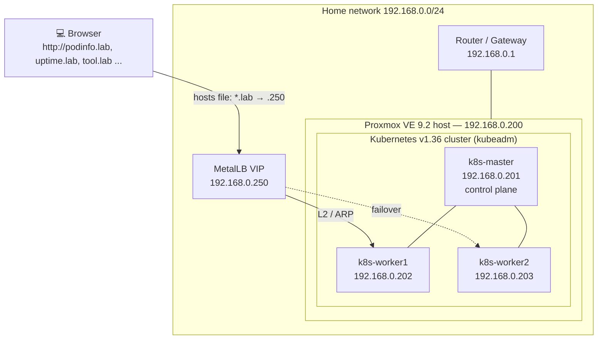
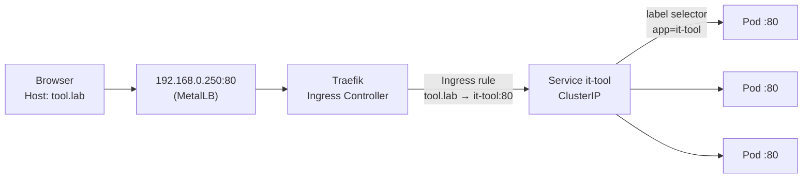

# homelab-k8s

> A production-style Kubernetes platform built from scratch on a repurposed laptop:
> bare-metal hypervisor → VM templates → kubeadm cluster → load balancing, ingress,
> persistent storage → self-written Helm charts.

🇹🇷 [Türkçe README](README.tr.md)


---

## Why this project?

I wanted hands-on experience with the things cloud providers normally hide from you.
On AWS or Azure you get a load balancer IP, an ingress endpoint and persistent disks
"for free". In this homelab **there was nothing** — every layer had to be built,
configured and debugged by hand, from BIOS settings up to the application's Helm chart.

---

## Architecture



### Request flow



One IP, one port, many applications: Traefik routes each request by its HTTP `Host` header.

### Network plan

| Address | Purpose |
|---|---|
| `192.168.0.1` | Router / default gateway |
| `192.168.0.2 – .249` | Router DHCP pool (other home devices) |
| `192.168.0.200` | Proxmox VE host |
| `192.168.0.201` | `k8s-master` (static) |
| `192.168.0.202` | `k8s-worker1` (static) |
| `192.168.0.203` | `k8s-worker2` (static) |
| `192.168.0.250 – .254` | MetalLB LoadBalancer pool (outside DHCP range) |
| `10.244.0.0/16` | Pod network (Flannel) |
| `10.96.0.0/12` | Service network (Kubernetes default) |

---

## Tech stack

| Layer | Tool | Notes |
|---|---|---|
| Hardware | Old laptop, 16 GB RAM | Repurposed as a 24/7 server, lid-close suspend disabled |
| Hypervisor | **Proxmox VE 9.2** | Type-1 (bare-metal) hypervisor, KVM/QEMU |
| Guest OS | **Ubuntu Server 26.04 LTS** | Cloned from a single prepared template |
| Container runtime | **containerd 2.2** | `SystemdCgroup = true` |
| Kubernetes | **v1.36.5 via kubeadm** | 1 control plane + 2 workers, vanilla (not k3s) |
| CNI | **Flannel** | Pod CIDR `10.244.0.0/16` |
| Package manager | **Helm 4** | Own charts + third-party charts with values files |
| Load balancer | **MetalLB** (L2 mode) | FRR/BGP components disabled to save RAM |
| Ingress | **Traefik** | Chosen over ingress-nginx, which was retired in March 2026 |
| Storage | **local-path-provisioner** | Default StorageClass, dynamic PV provisioning |
| Monitoring | **Uptime Kuma** | Uptime checks via in-cluster Service DNS |

---

## Repository structure

```
homelab-k8s/
├── charts/                     # Helm charts I wrote myself
│   ├── podinfo/                # Demo app: rolling update / rollback experiments
│   ├── whoami/                 # Stateless app, 3 replicas
│   ├── it-tools/               # Stateless SPA, 3 replicas
│   └── uptime-kuma/            # Stateful app: PVC, single replica, Recreate strategy
│       ├── Chart.yaml
│       ├── values.yaml
│       └── templates/
│           ├── deployment.yaml
│           ├── service.yaml
│           ├── ingress.yaml
│           └── pvc.yaml
├── infra/                      # Configuration for third-party platform components
│   ├── metallb/
│   │   ├── values.yaml         # Helm values (frrk8s disabled)
│   │   └── config.yaml         # IPAddressPool + L2Advertisement
│   ├── traefik/
│   │   └── values.yaml         # Pins the LoadBalancer IP to .250
│   └── local-path/
│       └── local-path-storage.yaml
└── docs/images/                # Screenshots used in this README
```

---

## How it was built

### Phase 0 — Turning a laptop into a hypervisor

- Verified CPU virtualization (VT-x) was enabled in BIOS.
- Installed **Proxmox VE** from USB, replacing Windows.
- Disabled suspend on lid close with a systemd-logind drop-in
  (`/etc/systemd/logind.conf.d/lid.conf`), since Debian 13 no longer ships `/etc/systemd/logind.conf`.
- Switched from the enterprise to the no-subscription update repository and upgraded the host.


### Phase 1 — A reusable VM template

Instead of installing Ubuntu three times, I prepared **one** VM and cloned it:

1. Installed Ubuntu Server with OpenSSH and `qemu-guest-agent`.
2. Applied everything every Kubernetes node needs:
   - swap disabled permanently (`swapoff -a` + `/etc/fstab`)
   - kernel modules `overlay`, `br_netfilter` and the required `sysctl` settings
   - containerd with `SystemdCgroup = true`
   - `kubeadm`, `kubelet`, `kubectl` from `pkgs.k8s.io`, pinned with `apt-mark hold`
3. Reset `/etc/machine-id` so each clone gets a unique identity (otherwise the router hands all clones the same DHCP lease).
4. Converted it to a **Proxmox template** and created three **full clones**.
5. Gave each clone its own hostname, static IP (netplan) and `/etc/hosts` entries.

### Phase 2 — Bootstrapping the cluster

```bash
# on k8s-master
sudo kubeadm init \
  --apiserver-advertise-address=192.168.0.201 \
  --pod-network-cidr=10.244.0.0/16

kubectl apply -f https://github.com/flannel-io/flannel/releases/latest/download/kube-flannel.yml

# on each worker
sudo kubeadm join 192.168.0.201:6443 --token <token> --discovery-token-ca-cert-hash sha256:<hash>
```


### Phase 3 — Deployments, Services, rolling updates

Deployed the first application with hand-written manifests to understand the building blocks:

- **Labels & selectors** tying Deployment → Pods ← Service together
- **Readiness vs. liveness probes**
- **Resource requests & limits**
- **The three ports** of a Service: `nodePort` (outside), `port` (inside the cluster), `targetPort` (the container)
- **Rolling update** to a new image version while a loop of `curl` requests confirmed zero downtime
- **Rollback** of a deliberately broken release (`ImagePullBackOff`); `maxUnavailable: 0` kept the old version serving traffic the whole time
- **Configuration drift**: why `kubectl rollout undo` must be followed by fixing the manifest in Git

### Phase 4 — Turning the cluster into a platform

| Problem | Solution |
|---|---|
| `type: LoadBalancer` stays `<pending>` forever | **MetalLB** hands out real IPs from the home network (L2/ARP) |
| One NodePort per app (`:30080`, `:30081` ...) | **Traefik** + Ingress rules: one IP, routing by host name |
| Data disappears when a Pod restarts | **local-path-provisioner** as the default StorageClass |


### Phase 5 — Writing my own Helm charts

I converted the raw manifests into a Helm chart (`values.yaml` + templated `templates/`),
then used it as a starting point for new applications, reading each image's documentation
to find its port, data directory and health endpoint:

| App | URL | Replicas | Storage | Notes |
|---|---|---|---|---|
| podinfo | `http://podinfo.lab` | 2 | – | Rolling update / rollback lab |
| whoami | `http://whoami.lab` | 3 | – | Visualizes load balancing across Pods |
| IT-Tools | `http://tool.lab` | 3 | – | Pinned image tag instead of `latest` |
| Uptime Kuma | `http://uptime.lab` | **1** | **1 Gi PVC** | SQLite → single replica + `Recreate` strategy |


---

## Design decisions

- **Vanilla Kubernetes (kubeadm) instead of k3s** — closer to what companies run and to the CKA exam; nothing is hidden.
- **Traefik instead of ingress-nginx** — ingress-nginx reached end of life in March 2026; Traefik supports both Ingress and Gateway API.
- **MetalLB pool outside the DHCP range** — prevents the router from handing a Service IP to a phone.
- **ClusterIP Services behind the Ingress** — no need to expose NodePorts once there is a single entry point.
- **Memory limits on every container, no CPU limits** — memory can't be shared when a node runs out; CPU limits mainly cause throttling.
- **Stateful app = 1 replica + `Recreate`** — two Pods must never open the same SQLite file, even for a few seconds during an update. Trade-off: a short downtime on restarts, in exchange for data integrity.
- **Pinned image tags** — `latest` makes deployments unreproducible.
- **Values files in Git instead of `helm --set`** — `--set` silently creates drift between the repository and the cluster.
- **Uptime Kuma checks Services through cluster DNS** (`<svc>.<ns>.svc.cluster.local`) — `*.lab` names only exist in my workstation's hosts file.

---

## Problems I hit (and how I solved them)

Real troubleshooting, in the order it happened:

| Symptom | Root cause | Fix |
|---|---|---|
| Proxmox web UI unreachable | Host IP set to `192.168.1.x`, router on `192.168.0.x` — different subnets | Re-addressed `/etc/network/interfaces` to `192.168.0.200/24` |
| `sed: can't read /etc/systemd/logind.conf` | Debian 13 no longer ships the file | Used a drop-in in `logind.conf.d/` |
| `kubeadm init`: `[ERROR Mem] ... 1642 MB` | VMs created with the default 2 GB RAM | Raised all nodes to 4 GB |
| Workers stuck at `Waiting for a healthy kubelet` | Swap was still on — the `fstab` line used tabs, my `sed` pattern expected spaces | Commented the swap line with a whitespace-agnostic pattern, `kubeadm reset`, re-join |
| MetalLB installed 5-container `frr-k8s` pods | New chart versions enable the BGP backend by default | Found `frrk8s.enabled` via `helm show values`, disabled it in a values file |
| `strict decoding error: unknown field` | Typos in field names (`ipAdressPools`, `accessMode`, `mounthPath`) | Read the error — Kubernetes names the exact field |
| Ingress not created, no error | `ingress.yaml` placed next to `templates/` instead of inside it | Helm only renders files inside `templates/` |
| `volumes` rejected / probes lost | `volumes:` indented inside the container block | Moved it to the Pod spec level, sibling of `containers:` |
| `/health` probe passing on an app without a health endpoint | SPA returns `index.html` (200) for every path | Changed the probe to `/` so the intent is explicit |

The most important lesson: **the dangerous bugs are the silent ones** — a label typo,
a wrong `targetPort` or a wrong `mountPath` produce no error at all. `helm template`
and following the Ingress → Service → Pod → PVC chain by name catches them before they ship.

---

## Roadmap

- [x] Proxmox hypervisor on bare metal
- [x] 3-node kubeadm cluster from a VM template
- [x] MetalLB + Traefik + local-path storage
- [x] Self-written Helm charts for 4 applications
- [ ] **GitOps with Argo CD** — this repository becomes the single source of truth
- [ ] CI with Jenkins: build → SonarQube → Trivy image scan → push
- [ ] Prometheus + Grafana monitoring
- [ ] TLS with cert-manager
- [ ] Rebuild everything with Terraform (Proxmox provider) + Ansible

---

## Reproducing

```bash
# Platform components
helm repo add metallb https://metallb.github.io/metallb
helm repo add traefik https://traefik.github.io/charts
helm repo update

helm upgrade --install metallb metallb/metallb -n metallb-system --create-namespace -f infra/metallb/values.yaml
kubectl apply -f infra/metallb/config.yaml
helm upgrade --install traefik traefik/traefik -n traefik --create-namespace -f infra/traefik/values.yaml
kubectl apply -f infra/local-path/local-path-storage.yaml

# Applications
for app in podinfo whoami it-tools uptime-kuma; do
  helm upgrade --install "$app" "charts/$app" -n "$app" --create-namespace
done
```

Then point the `*.lab` names to `192.168.0.250` in your hosts file.
