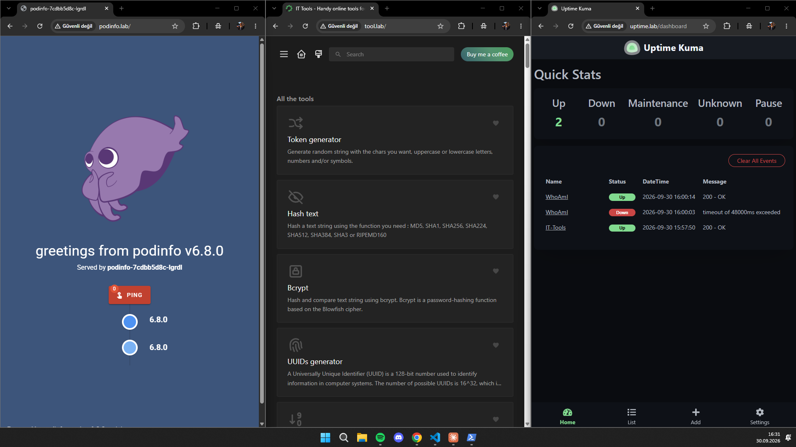
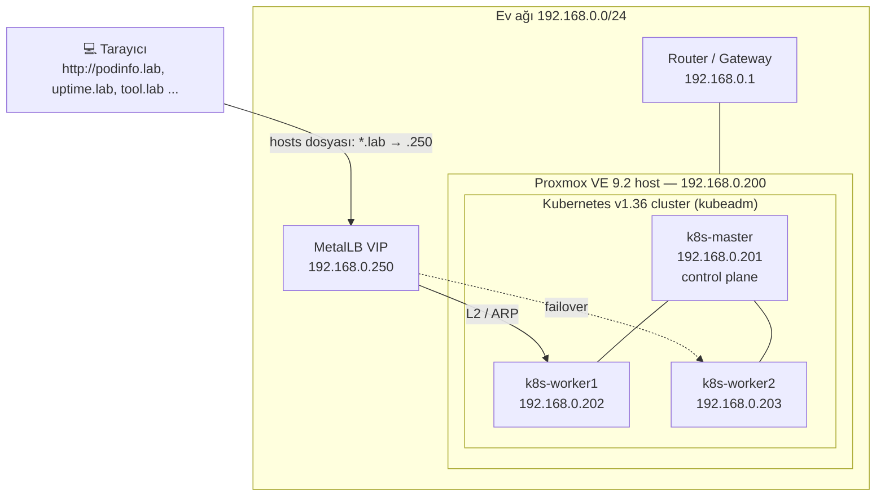
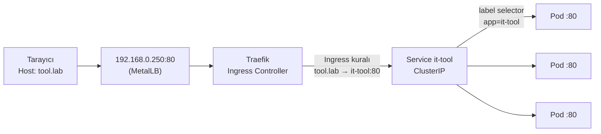
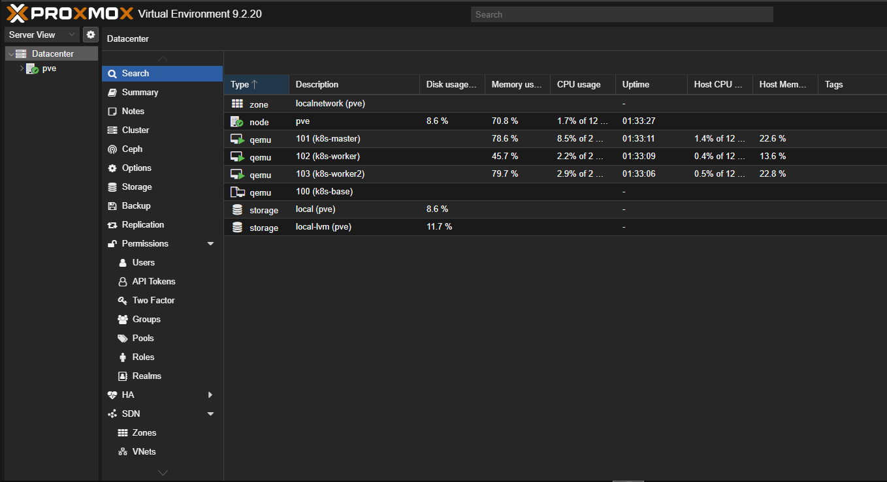
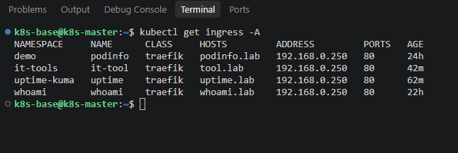
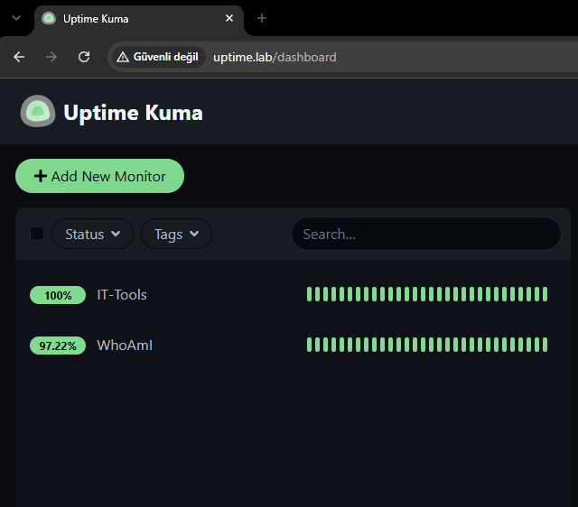

# homelab-k8s

> Eski bir laptop üzerinde sıfırdan kurulmuş, production benzeri bir Kubernetes platformu:
> bare-metal hypervisor → VM şablonları → kubeadm cluster → yük dengeleme, ingress,
> kalıcı depolama → kendi yazdığım Helm chart'ları.

🇬🇧 [English README](README.md)



---

## Neden bu proje?

Bulut sağlayıcılarının normalde bizden sakladığı katmanlarda gerçek deneyim kazanmak istedim.
AWS ya da Azure'da load balancer IP'si, ingress adresi ve kalıcı disk "hazır" gelir.
Bu homelab'de **hiçbiri yoktu**: BIOS ayarlarından uygulamanın Helm chart'ına kadar her katmanı
elle kurdum, yapılandırdım ve hatalarını ayıkladım.

---

## Mimari



### Bir isteğin yolculuğu



Tek IP, tek port, birçok uygulama: Traefik her isteği HTTP `Host` başlığına göre yönlendiriyor.

### Ağ planı

| Adres | Görevi |
|---|---|
| `192.168.0.1` | Router / varsayılan ağ geçidi |
| `192.168.0.2 – .249` | Router DHCP havuzu (evdeki diğer cihazlar) |
| `192.168.0.200` | Proxmox VE host |
| `192.168.0.201` | `k8s-master` (sabit) |
| `192.168.0.202` | `k8s-worker1` (sabit) |
| `192.168.0.203` | `k8s-worker2` (sabit) |
| `192.168.0.250 – .254` | MetalLB LoadBalancer havuzu (DHCP aralığının dışında) |
| `10.244.0.0/16` | Pod ağı (Flannel) |
| `10.96.0.0/12` | Service ağı (Kubernetes varsayılanı) |

---

## Kullanılan teknolojiler

| Katman | Araç | Not |
|---|---|---|
| Donanım | Eski laptop, 16 GB RAM | 7/24 sunucuya çevrildi, kapak kapanınca uyku kapatıldı |
| Hypervisor | **Proxmox VE 9.2** | Type-1 (bare-metal) hypervisor, KVM/QEMU |
| Misafir işletim sistemi | **Ubuntu Server 26.04 LTS** | Tek bir hazırlanmış şablondan klonlandı |
| Container runtime | **containerd 2.2** | `SystemdCgroup = true` |
| Kubernetes | **kubeadm ile v1.36.5** | 1 control plane + 2 worker, vanilla (k3s değil) |
| CNI | **Flannel** | Pod CIDR `10.244.0.0/16` |
| Paket yöneticisi | **Helm 4** | Kendi chart'larım + values dosyalarıyla hazır chart'lar |
| Load balancer | **MetalLB** (L2 modu) | RAM tasarrufu için FRR/BGP bileşenleri kapatıldı |
| Ingress | **Traefik** | Mart 2026'da emekliye ayrılan ingress-nginx yerine seçildi |
| Depolama | **local-path-provisioner** | Varsayılan StorageClass, dinamik PV oluşturma |
| İzleme | **Uptime Kuma** | Cluster içi Service DNS üzerinden erişilebilirlik kontrolü |

---

## Repo yapısı

```
homelab-k8s/
├── charts/                     # Kendi yazdığım Helm chart'ları
│   ├── podinfo/                # Demo uygulama: rolling update / rollback deneyleri
│   ├── whoami/                 # Durumsuz (stateless) uygulama, 3 replika
│   ├── it-tools/               # Durumsuz SPA, 3 replika
│   └── uptime-kuma/            # Durumlu (stateful) uygulama: PVC, tek replika, Recreate
│       ├── Chart.yaml
│       ├── values.yaml
│       └── templates/
│           ├── deployment.yaml
│           ├── service.yaml
│           ├── ingress.yaml
│           └── pvc.yaml
├── infra/                      # Hazır platform bileşenlerinin ayarları
│   ├── metallb/
│   │   ├── values.yaml         # Helm values (frrk8s kapalı)
│   │   └── config.yaml         # IPAddressPool + L2Advertisement
│   ├── traefik/
│   │   └── values.yaml         # LoadBalancer IP'sini .250'ye sabitler
│   └── local-path/
│       └── local-path-storage.yaml
└── docs/images/                # README'deki ekran görüntüleri
```

---

## Nasıl kuruldu?

### Aşama 0: Laptopu hypervisor'a çevirmek

- BIOS'ta CPU sanallaştırmasının (VT-x) açık olduğunu doğruladım.
- Windows'u silip USB'den **Proxmox VE** kurdum.
- Kapak kapanınca uyumayı systemd-logind drop-in dosyasıyla kapattım
  (`/etc/systemd/logind.conf.d/lid.conf`). Debian 13'te `/etc/systemd/logind.conf` artık varsayılan olarak gelmiyor.
- Enterprise güncelleme deposunu kapatıp no-subscription deposunu açtım ve host'u güncelledim.


### Aşama 1: Tekrar kullanılabilir bir VM şablonu

Ubuntu'yu üç kez kurmak yerine **tek** bir VM hazırlayıp klonladım:

1. Ubuntu Server'ı OpenSSH ve `qemu-guest-agent` ile kurdum.
2. Her Kubernetes node'unun ihtiyaç duyduğu ayarları yaptım:
   - swap'ı kalıcı olarak kapattım (`swapoff -a` + `/etc/fstab`)
   - `overlay`, `br_netfilter` kernel modüllerini ve gerekli `sysctl` ayarlarını ekledim
   - `SystemdCgroup = true` ile containerd
   - `pkgs.k8s.io`'dan `kubeadm`, `kubelet`, `kubectl`, `apt-mark hold` ile sabitlenmiş
3. Her klonun kendine ait bir kimliği olsun diye `/etc/machine-id`'yi sıfırladım (yoksa router tüm klonlara aynı DHCP IP'sini veriyor).
4. VM'i **Proxmox template**'ine çevirip üç **full clone** oluşturdum.
5. Her klona kendi hostname'ini, sabit IP'sini (netplan) ve `/etc/hosts` kayıtlarını verdim.

### Aşama 2: Cluster'ı ayağa kaldırmak

```bash
# k8s-master üzerinde
sudo kubeadm init \
  --apiserver-advertise-address=192.168.0.201 \
  --pod-network-cidr=10.244.0.0/16

kubectl apply -f https://github.com/flannel-io/flannel/releases/latest/download/kube-flannel.yml

# her worker üzerinde
sudo kubeadm join 192.168.0.201:6443 --token <token> --discovery-token-ca-cert-hash sha256:<hash>
```



### Aşama 3: Deployment, Service ve rolling update

Temel yapı taşlarını anlamak için ilk uygulamayı elle yazdığım YAML'larla deploy ettim:

- Deployment → Pod ← Service bağlantısını kuran **label ve selector'lar**
- **Readiness ve liveness probe** farkı
- **Resource request ve limit'ler**
- Service'in **üç portu**: `nodePort` (dışarısı), `port` (cluster içi), `targetPort` (container)
- Sürekli `curl` isteği atan bir döngüyle **kesintisiz rolling update** doğrulaması
- Bilerek bozulmuş bir sürümün (`ImagePullBackOff`) **geri alınması**. `maxUnavailable: 0` sayesinde eski sürüm tüm süre boyunca trafiğe cevap verdi
- **Configuration drift**: `kubectl rollout undo`'dan sonra neden Git'teki dosyanın da düzeltilmesi gerektiği

### Aşama 4: Cluster'ı platforma çevirmek

| Sorun | Çözüm |
|---|---|
| `type: LoadBalancer` sonsuza kadar `<pending>` kalıyor | **MetalLB** ev ağından gerçek IP dağıtıyor (L2/ARP) |
| Her uygulama için ayrı NodePort (`:30080`, `:30081` ...) | **Traefik** + Ingress kuralları: tek IP, isimle yönlendirme |
| Pod yeniden başlayınca veri kayboluyor | Varsayılan StorageClass olarak **local-path-provisioner** |



### Aşama 5: Kendi Helm chart'larımı yazmak

Düz YAML'ları bir Helm chart'ına (`values.yaml` + şablonlanmış `templates/`) çevirdim.
Sonra bu chart'ı yeni uygulamalar için başlangıç noktası olarak kullandım. Her image'ın
dokümantasyonunu okuyarak portunu, veri klasörünü ve sağlık kontrolü adresini buldum:

| Uygulama | Adres | Replika | Depolama | Not |
|---|---|---|---|---|
| podinfo | `http://podinfo.lab` | 2 | – | Rolling update / rollback laboratuvarı |
| whoami | `http://whoami.lab` | 3 | – | Pod'lar arası yük dağılımını gösteriyor |
| IT-Tools | `http://tool.lab` | 3 | – | `latest` yerine sabit image tag'i |
| Uptime Kuma | `http://uptime.lab` | **1** | **1 Gi PVC** | SQLite → tek replika + `Recreate` stratejisi |



---

## Tasarım kararları

- **k3s yerine vanilla Kubernetes (kubeadm):** Şirketlerin kullandığına ve CKA sınavına daha yakın, hiçbir şey gizlenmiyor.
- **ingress-nginx yerine Traefik:** ingress-nginx Mart 2026'da emekliye ayrıldı. Traefik hem Ingress'i hem Gateway API'yi destekliyor.
- **MetalLB havuzu DHCP aralığının dışında:** Router'ın bir Service IP'sini telefona vermesini engelliyor.
- **Ingress arkasında ClusterIP Service'ler:** Tek bir giriş kapısı varken NodePort açmaya gerek yok.
- **Her container'da bellek limiti var, CPU limiti yok:** Node'da bellek bitince paylaşılamaz. CPU limiti ise çoğunlukla gereksiz yavaşlamaya (throttling) yol açıyor.
- **Durumlu uygulama = 1 replika + `Recreate`:** İki pod aynı SQLite dosyasını, güncelleme sırasında birkaç saniyeliğine bile olsa, asla aynı anda açmamalı. Takas: yeniden başlatmalarda kısa bir kesinti, karşılığında veri bütünlüğü.
- **Sabit image tag'leri:** `latest` deployment'ları tekrarlanamaz hâle getirir.
- **`helm --set` yerine Git'teki values dosyaları:** `--set` repo ile cluster arasında sessizce sapma (drift) yaratır.
- **Uptime Kuma, Service'leri cluster DNS'i üzerinden kontrol ediyor** (`<svc>.<ns>.svc.cluster.local`): `*.lab` isimleri sadece benim bilgisayarımın hosts dosyasında var.

---

## Karşılaştığım sorunlar ve çözümleri

Gerçek hata ayıklama süreci, yaşandığı sırayla:

| Belirti | Kök neden | Çözüm |
|---|---|---|
| Proxmox web arayüzüne erişilemiyor | Host IP'si `192.168.1.x`, router `192.168.0.x`: farklı alt ağlar | `/etc/network/interfaces`'te IP'yi `192.168.0.200/24` yaptım |
| `sed: can't read /etc/systemd/logind.conf` | Debian 13 bu dosyayı artık içermiyor | `logind.conf.d/` altında drop-in dosyası kullandım |
| `kubeadm init`: `[ERROR Mem] ... 1642 MB` | VM'ler varsayılan 2 GB RAM ile oluşturulmuş | Tüm node'ları 4 GB'a çıkardım |
| Worker'lar `Waiting for a healthy kubelet` aşamasında takıldı | Swap hâlâ açıktı: `fstab` satırı tab içeriyordu, `sed` kalıbım boşluk bekliyordu | Boşluk türünden bağımsız bir kalıpla swap satırını kapattım, `kubeadm reset`, tekrar join |
| MetalLB 5 container'lık `frr-k8s` pod'ları kurdu | Yeni chart sürümleri BGP bileşenini varsayılan olarak açıyor | `helm show values` ile `frrk8s.enabled`'ı buldum, values dosyasıyla kapattım |
| `strict decoding error: unknown field` | Alan adlarında yazım hataları (`ipAdressPools`, `accessMode`, `mounthPath`) | Hata mesajını okudum, Kubernetes hatalı alanın adını tam olarak söylüyor |
| Ingress oluşmadı, hata da yok | `ingress.yaml`'ı `templates/`'in içine değil yanına koymuşum | Helm sadece `templates/` içindeki dosyaları işliyor |
| `volumes` reddedildi / probe'lar kayboldu | `volumes:` container bloğunun içine girintilenmişti | `containers:` ile kardeş olacak şekilde Pod seviyesine taşıdım |
| Sağlık adresi olmayan bir uygulamada `/health` probe'u geçiyor | SPA her adres için `index.html` (200) dönüyor | Niyet açıkça belli olsun diye probe'u `/` yaptım |

En önemli ders: **Tehlikeli hatalar sessiz olanlar.** Label'daki bir yazım hatası, yanlış
`targetPort` ya da yanlış `mountPath` hiçbir hata mesajı üretmiyor. `helm template` ile
çıktıyı okumak ve Ingress → Service → Pod → PVC zincirini isimler üzerinden takip etmek
bu hataları cluster'a gitmeden yakalıyor.

---

## Yol haritası

- [x] Bare metal üzerinde Proxmox hypervisor
- [x] VM şablonundan 3 node'lu kubeadm cluster
- [x] MetalLB + Traefik + local-path depolama
- [x] 4 uygulama için kendi yazdığım Helm chart'ları
- [ ] **Argo CD ile GitOps**: Bu repo tek doğruluk kaynağı olacak
- [ ] Jenkins ile CI: build → SonarQube → Trivy image taraması → push
- [ ] Prometheus + Grafana ile izleme
- [ ] cert-manager ile TLS
- [ ] Her şeyi Terraform (Proxmox provider) + Ansible ile yeniden kurmak

---

## Tekrar kurmak için

```bash
# Platform bileşenleri
helm repo add metallb https://metallb.github.io/metallb
helm repo add traefik https://traefik.github.io/charts
helm repo update

helm upgrade --install metallb metallb/metallb -n metallb-system --create-namespace -f infra/metallb/values.yaml
kubectl apply -f infra/metallb/config.yaml
helm upgrade --install traefik traefik/traefik -n traefik --create-namespace -f infra/traefik/values.yaml
kubectl apply -f infra/local-path/local-path-storage.yaml

# Uygulamalar
for app in podinfo whoami it-tools uptime-kuma; do
  helm upgrade --install "$app" "charts/$app" -n "$app" --create-namespace
done
```

Son olarak hosts dosyanda `*.lab` isimlerini `192.168.0.250`'ye yönlendir.
